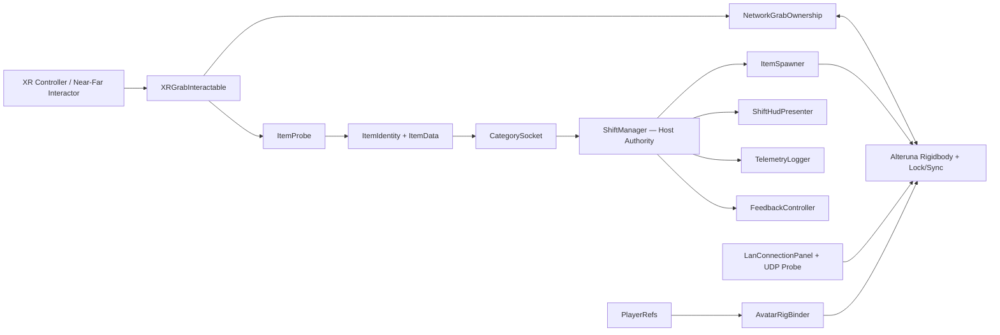
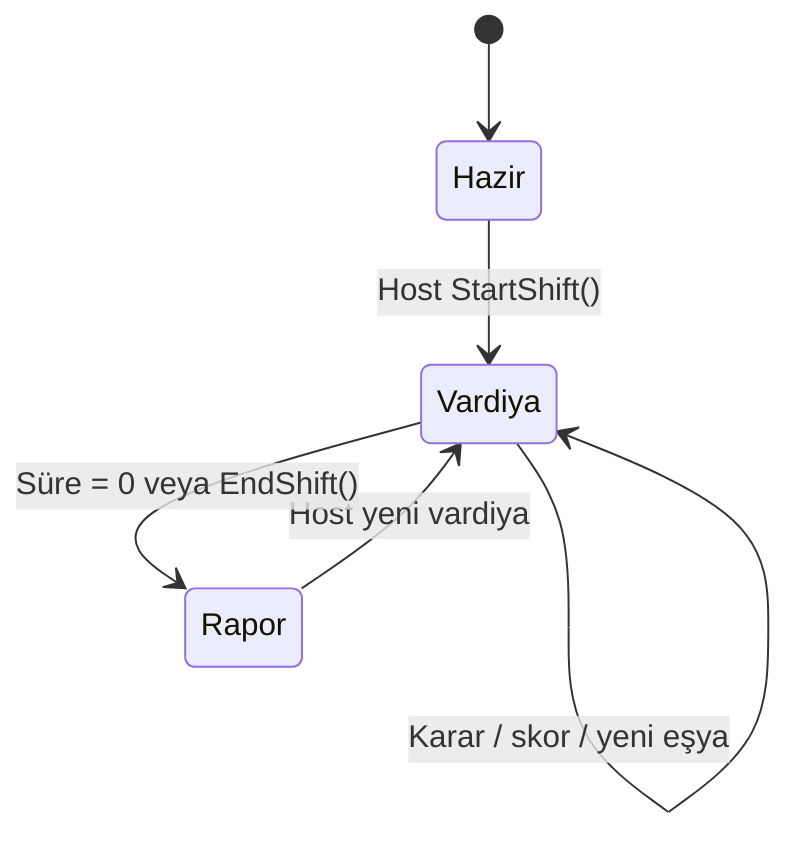
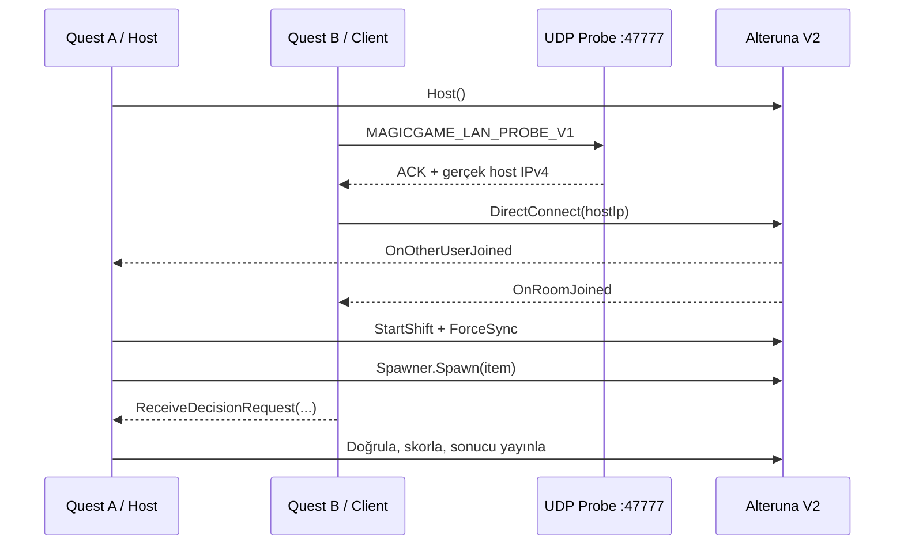

# Sort It! — İki Oyunculu VR Sınıflandırma Oyunu

<p align="center">
  
</p>

<p align="center">
  
  
  
  
  
  
</p>

**Sort It!**, aynı yerel ağdaki iki Meta Quest oyuncusunun gizemli eşyaları ses, ışık ve dokunsal ipuçlarıyla inceleyip doğru dolaplara yerleştirdiği, 90 saniyelik rekabetçi vardiyalardan oluşan bir VR oyunudur. Oyun; OpenXR tabanlı etkileşim, Alteruna V2 ile host-otoriter LAN senkronizasyonu, ağ üzerinden sahiplik devri, oyuncu bazlı skor/rapor ve CSV telemetri üretimini tek akışta birleştirir.

> [!IMPORTANT]
> Proje tam olarak **Unity `6000.3.21f1`** ile geliştirilmiştir. Unity sürümünü değiştirmek; XRI örneklerini, OpenXR ayarlarını, sahne serileştirmesini ve Android build zincirini değiştirebilir. İlk açılışta farklı bir Unity sürümü kullanmayın.

## İçindekiler

- [Proje özeti](#proje-özeti)
- [Oyun döngüsü ve kurallar](#oyun-döngüsü-ve-kurallar)
- [Özellikler](#özellikler)
- [Teknoloji yığını](#teknoloji-yığını)
- [Mimari](#mimari)
- [Ağ modeli ve LAN protokolü](#ağ-modeli-ve-lan-protokolü)
- [Eşya sistemi](#eşya-sistemi)
- [Sahne ve klasör yapısı](#sahne-ve-klasör-yapısı)
- [Kurulum](#kurulum)
- [Çalıştırma ve iki cihaz testi](#çalıştırma-ve-iki-cihaz-testi)
- [Android APK alma](#android-apk-alma)
- [Telemetri ve loglama](#telemetri-ve-loglama)
- [Test ve doğrulama](#test-ve-doğrulama)
- [Karşılaşılan hatalar ve çözümleri](#karşılaşılan-hatalar-ve-çözümleri)
- [Bilinen sınırlamalar ve teknik borç](#bilinen-sınırlamalar-ve-teknik-borç)
- [Araştırma ve teknik kararlar](#araştırma-ve-teknik-kararlar)
- [Katkıcılar ve sorumluluklar](#katkıcılar-ve-sorumluluklar)
- [Git geçmişi ve tüm commitler](#git-geçmişi-ve-tüm-commitler)
- [Lisans ve üçüncü taraf varlıklar](#lisans-ve-üçüncü-taraf-varlıklar)

## Proje özeti

| Alan | Değer |
|---|---|
| Ürün adı | `Sort It!` |
| Şirket/ekip kimliği | `XRLab` |
| Android application ID | `com.xrlab.sortit` |
| Uygulama sürümü | `2.1` |
| Android version code | `1` |
| Ana hedef | Meta Quest ailesi, Android/ARM64 |
| Oyun modu | Aynı Wi-Fi üzerinde 2 oyunculu LAN |
| Tur süresi | `90` saniye |
| Skor | Doğru yerleştirme `+1`, yanlış yerleştirme `-1` |
| Eşzamanlı eşya | Varsayılan `2` |
| Ana sahne | `Assets/_Project/Scenes/Main.unity` |
| Render pipeline | URP `17.3.0` |
| Ağ SDK'sı | Alteruna Multiplayer SDK V2 `2.1.1003` (`2.1.1r3`) |
| Özel oyun kodu | 23 C# dosyası, yaklaşık 5.085 satır |
| Son belgelenen HEAD | `a0ef459` — 27 Ağustos 2026 |
| Git geçmişi | 6–27 Ağustos 2026, tüm ref'lerde 71 commit |

Depoda ayrıca çalıştırılabilir son Android çıktısı olan `Sort It!.apk` bulunur. İncelenen dosyanın boyutu `62.432.903` bayt, SHA-256 özeti `5ACFC9A46DC54D9FB680575E055A69012F8DC9E89FC7B3BD7548B73CBDEE55DA` değeridir. Bu bilgi yalnızca bütünlük kontrolü içindir; yeni bir sürüm üretildiğinde güncellenmelidir.

## Oyun döngüsü ve kurallar

1. İki Quest aynı, istemci izolasyonu kapalı Wi-Fi ağına bağlanır.
2. Bir cihaz **HOST LAN**, diğer cihaz **JOIN LAN** seçer.
3. Host **Yeni Vardiya** ile 90 saniyelik turu başlatır.
4. Host, deterministik sıradan en fazla iki eşyayı Alteruna `Spawner` üzerinden üretir.
5. Oyuncular eşyayı Near/Far Interactor ile alır ve üç kanaldan inceler:
   - **Sesli:** Elde sallandığında ses çıkarır ve sallama sayısı tutulur.
   - **Parlak:** Yüze yaklaşık `0,35 m` yaklaştırıldığında emissive renk verir.
   - **Ağır:** Elde tutulduğu sürece kütleye bağlı haptik geri bildirim üretir.
6. Eşya bir kategori dolabına bırakılır. Soket yanlış eşyayı da bilinçli olarak kabul eder; karar ancak yerleştirmeden sonra verilir.
7. Doğru cevapta eşya ağdan kaldırılır, skor artar ve boş yuva `0,5 s` sonra doldurulur.
8. Yanlış cevapta skor azalır; dolap kırmızı/ses/haptik geri bildirim verir ve eşya `0,4 s` sonra dışarı itilir.
9. Süre bitince host vardiyayı kapatır, kalan ağ eşyalarını temizler ve iki oyuncu için rapor üretir.

Rapor; doğru/yanlış sayısını, toplam skoru, vardiya galibiyetini, ortalama karar süresini ve en çok karıştırılan kategoriyi oyuncu bazında gösterir. Eşit skorda kazanan `Berabere` olarak işaretlenir.

## Özellikler

- Meta Quest ve Oculus Touch/Touch Plus profilleriyle OpenXR tabanlı VR çalışma.
- XRI 3.4.1 Near/Far grab, socket, poke/ray UI ve haptik etkileşimleri.
- Bulut oda tarayıcısı gerektirmeyen iki cihazlı Alteruna LAN akışı.
- Android multicast izni ve `WifiManager.MulticastLock` ile UDP keşif desteği.
- Alteruna'nın hatalı `127.0.0.1` keşif sonucunu aşmak için bağımsız UDP probe ve otomatik `DirectConnect(hostIp)`.
- Host-otoriter vardiya, skor, karar doğrulama, spawn/despawn ve rapor üretimi.
- Aynı eşyayı iki oyuncunun eşzamanlı almasını engelleyen ağ kilidi ve sahiplik devri.
- Yerel XR rigini host/client başlangıç noktasına güvenli biçimde sıfırlama.
- Host tarafından aynı konumda üretilen ve `ForceSync` ile paylaşılan eşyalar.
- Oyuncu avatarının baş/el pozlarını takip eden senkron avatar rig'i.
- Doğru/yanlış için eşzamanlı görsel, işitsel ve haptik geri bildirim.
- Vardiya bazlı CSV telemetri.
- `System.Random` ve loglanan seed ile tekrar üretilebilir spawn sırası.
- Ana sahneyi, sandbox'ları, prefabları ve varlıkları yeniden kuran Editor araçları.
- URP uyumlu özel toon shader ve ayrı shader belgesi.

## Teknoloji yığını

### Temel sürümler

| Bileşen | Sürüm/kaynak | Kullanım |
|---|---|---|
| Unity Editor | `6000.3.21f1` | Oyun motoru ve build zinciri |
| C# | Unity 6 derleyici profili | Oyun, Editor ve ağ kodu |
| Universal Render Pipeline | `17.3.0` | Quest uyumlu render ve özel toon shader |
| Input System | `1.20.0` | Action-based XR girişleri |
| XR Interaction Toolkit | `3.4.1` | Grab, socket, ray/poke UI, haptik |
| OpenXR Plugin | `1.16.1` | Quest ve PC XR runtime katmanı |
| Meta OpenXR | `2.5.0` | Meta Quest özellikleri |
| XR Hands | `1.7.3` | El izleme altyapısı ve örnek varlıklar |
| XR Plug-in Management | `4.5.4` | Android/Standalone loader yönetimi |
| XR Core Utilities | `2.6.0` | XR Origin ve ortak yardımcılar |
| Composition Layers | `2.5.0` | OpenXR composition layer desteği |
| Alteruna Multiplayer SDK | Git hash `d1bfa5a0...`, paket `2.1.1003` | LAN, avatar, spawn, senkron alan/metotlar |

Alteruna paketi `Packages/manifest.json` içinde Git URL'siyle tanımlanır ve `Packages/packages-lock.json` içindeki `d1bfa5a0b6e8cbd3f14eb17c5322741aa0cbbfb7` hash'iyle kilitlenir. Alteruna'nın sürüm gösterimi farklıdır: `2.1.1r3`, Unity Package Manager'da `2.1.1003` görünür.

### Android ayarları

| Ayar | Değer |
|---|---|
| Mimari | ARM64 |
| Scripting backend | IL2CPP |
| Minimum SDK | API 32 |
| Target SDK | Unity tarafından otomatik (`0`) |
| Graphics API | Vulkan |
| Custom main manifest | Açık |
| Engine code stripping | Açık |
| Android veri tercihi | Harici veri alanı |

Custom manifest; `INTERNET`, ağ durumu, Wi-Fi durumu, multicast değiştirme, mikrofon/ses ve isteğe bağlı el takibi izinlerini tanımlar. Vulkan cihaz özelliği zorunludur; dokunmatik ekran ve mikrofon zorunlu değildir.

## Mimari



### Mimari ilkeler

1. **Host otoritesi:** Skor, süre, spawn/despawn ve nihai karar yalnız hostta değişir. Client karar isteğini hosta yollar.
2. **Tek spawn noktası:** Oyun eşyaları yalnız `ItemSpawner` ve Alteruna `Spawner` üzerinden oluşturulur.
3. **Veri/ davranış ayrımı:** Eşya sabitleri `ItemData` ScriptableObject'lerinde, çalışma davranışı `ItemProbe` ve ağ bileşenlerindedir.
4. **Deterministik sıra:** Spawn kuyruğu `System.Random` ile karıştırılır; kullanılan seed loglanır.
5. **Event tabanlı UI/telemetri:** HUD ve CSV logger, `ShiftManager` event'lerine abone olur; oyun durumunu her kare yoklamaz.
6. **Yanlış cevabı kabul etme:** `CategorySocket.CanSelect` kategori filtresi uygulamaz. Eğitimsel geri bildirim için yanlış nesne önce sokete alınır, sonra reddedilir.
7. **Senkron fizik sahipliği:** Eşyayı alan oyuncu Alteruna lock ister; diğer oyuncunun grab bileşeni sahiplik süresince kapanır.

### Ana sınıflar

| Dosya/sınıf | Sorumluluk |
|---|---|
| `Core/LanConnectionPanel.cs` | LAN paneli, manager yaşam döngüsü, UDP probe, multicast lock, direct connect, bağlantı teşhisi |
| `Core/ShiftManager.cs` | Host-otoriter vardiya state machine'i, süre, skor, karar ve rapor senkronizasyonu |
| `Core/ItemSpawner.cs` | Deterministik kuyruk, en fazla iki aktif eşya, ağ spawn/despawn ve eşya kurtarma |
| `Items/NetworkGrabOwnership.cs` | Eşya lock/sahipliği, rigidbody sync, çift tutmayı önleme, son etkileşen oyuncu |
| `Cabinets/CategorySocket.cs` | Kategori kararı, inceleme süresi, hosta istek, yanlış eşyayı gecikmeli dışarı atma |
| `Cabinets/FeedbackController.cs` | Emission, doğru/yanlış sesleri, haptik ve particle burst |
| `Items/ItemProbe.cs` | Sesli/parlak/ağır ipucu kanalları ve sallama sayısı |
| `Items/ItemData.cs` | ID, ad, kategori, kütle, ses ve parlama rengi veri sözleşmesi |
| `Shared/AvatarRigBinder.cs` | Yerel XR baş/el pozlarını ağ avatarına bağlama |
| `Shared/PlayerRefs.cs` | XR Origin, kamera, baş ve controller referanslarını çözme; konum sıfırlama |
| `Shared/FarGrabDistanceLimiter.cs` | Uzak tutuşun `0,20 m` altına çökmesini ve ışın ekseninin bükülmesini önleme |
| `UI/ShiftHudPresenter.cs` | Süre, skor, son karar, durum ve vardiya raporu sunumu |
| `Core/TelemetryLogger.cs` | Hostta her kararı UTF-8 CSV'ye ekleme |
| `Core/ChimneyEffect.cs` | Bacadan eşya çıktığında ses/ışık sunumu |
| `Core/NetworkTestSpawner.cs` | Ana oyundan bağımsız ilk LAN spawn doğrulaması |

### Vardiya state machine'i



`ShiftState` değerleri `Hazir`, `Vardiya` ve `Rapor`dur. Host saniye değişiminde `ForceSync` yapar. Client, senkronize alan değişikliklerini gözleyerek UI event'lerini yerel olarak tekrar yayınlar.

## Ağ modeli ve LAN protokolü

### Neden özel LAN keşfi var?

Alteruna V2 `JoinLan()` akışı Quest üzerinde keşfedilen gerçek host IP'si yerine `127.0.0.1` adresine bağlanmayı tekrar deneyebiliyordu. Proje, SDK'yı fork etmeden şu katmanı ekler:

1. Host UDP `47777` portunda `MAGICGAME_LAN_PROBE_V1` mesajlarını dinler.
2. Client aynı ağda keşif paketi yayınlar.
3. Host `MAGICGAME_LAN_PROBE_ACK_V1` cevabını yollar.
4. Client paketin kaynak IPv4 adresini gerçek host adresi olarak alır.
5. Resmî Alteruna `DirectConnect(ip)` API'si otomatik çağrılır.
6. Kullanıcı IP girmek zorunda kalmaz; bulut oda listesi kullanılmaz.

Android Wi-Fi yığını broadcast/multicast paketlerini filtreleyebildiğinden uygulama aktifken `WifiManager.MulticastLock` alınır, pause sırasında bırakılır ve dönüşte yeniden alınır.

### Bağlantı sırası



### Yetki tablosu

| İşlem | Host | Client |
|---|:---:|:---:|
| LAN odası oluşturma | ✅ | ❌ |
| LAN hostuna katılma | ❌ | ✅ |
| Vardiya başlatma/bitirme | ✅ | ❌ |
| Eşya üretme/kaldırma | ✅ | ❌ |
| Eşya tutma | ✅ | ✅ |
| Karar isteği gönderme | Yerel uygular | Hosta RPC yollar |
| Nihai karar/skor değişikliği | ✅ | ❌ |
| Aktif eşyaları bacaya döndürme | ✅ | ❌ |
| Yerel XR konumunu sıfırlama | ✅ | ✅ |
| Telemetri CSV yazma | ✅ | ❌ |

`IsConnected`, Alteruna servis bağlantısını; `InRoom`, gerçek oyun odasını temsil eder. Host tarafında uzak endpoint olmadığı için bazı durumlarda `IsConnected == false` iken `InRoom == true` olabilir. Oyun otoritesi ve buton kilitleri bu nedenle `InRoom` ve `IsHost()` üzerinden hesaplanır.

## Eşya sistemi

### Veri modeli

Her eşya prefabında en az şu bileşenler beklenir:

- `ItemIdentity` → bir `ItemData` varlığına işaret eder.
- `ItemProbe` → kategoriye göre ses/parlaklık/haptik davranışı üretir.
- `XRGrabInteractable` → XRI seçme ve tutma.
- `RigidbodySynchronizable` → Alteruna fizik senkronizasyonu.
- `NetworkGrabOwnership` → lock ve sahiplik.

`ItemData` alanları:

| Alan | Açıklama |
|---|---|
| `id` | Ağ ve telemetride kullanılan kalıcı tamsayı kimlik |
| `displayName` | UI/log adı |
| `category` | `Sesli=0`, `Parlak=1`, `Agir=2` |
| `mass` | Rigidbody/haptik şiddeti için kütle |
| `rattleClip` | Sesli eşyanın sallama klibi |
| `glowColor` | Parlak eşyanın HDR emission rengi |

### Depodaki mevcut ItemData kayıtları

Bu tablo dosya adına göre varsayım değil, `.asset` içindeki gerçek serialize değerlerine göre hazırlanmıştır.

| ID | Görünen ad | Dosya | Gerçek kategori | Kütle |
|---:|---|---|---|---:|
| 101 | Cingirak | `Data_Sesli_Cingirak` | Sesli | 1,0 |
| 102 | Kutu | `Data_Sesli_Kutu` | Ağır | 10,0 |
| 103 | Kumbara | `Data_Sesli_Kumbara` | Parlak | 1,2 |
| 201 | Kure | `Data_Parlak_Kure` | Ağır | 10,0 |
| 202 | Kristal | `Data_Parlak_Kristal` | Sesli | 1,0 |
| 203 | Fener | `Data_Parlak_Fener` | Parlak | 1,5 |
| 301 | Kulp | `Data_Agir_Kulp` | Parlak | 1,0 |
| 302 | Ors | `Data_Agir_Ors` | Sesli | 1,0 |
| 303 | Kese | `Data_Agir_Kese` | Ağır | 10,0 |

Dosya adları görsel temayı, `ItemData.category` ise gerçek oynanış cevabını belirler. Bu çapraz dağılım bilinçli bir gizem tasarımıysa korunmalıdır; değilse veri tutarlılığı görevi açılmalıdır.

### Soket karar akışı

- Hover başlayınca mevcut uygulama inceleme zamanını başlatır.
- Select girişinde `ItemIdentity`/`ItemData` çözülür.
- Yerel oyuncu indeksi `NetworkGrabOwnership.LastInteractorIndex` üzerinden korunur.
- Client karar isteğini hosta yollar; host aktif ağ eşyasını ID ile doğrular.
- `0,75 s` içindeki aynı oyuncu/eşya/kategori yinelenen kararı yok sayılır.
- Doğruysa eşya despawn edilir.
- Yanlışsa `0,4 s` beklenir, seçim bırakılır, bir fizik karesi beklenir ve `1,2 m/s` hız değişimiyle dışarı itilir.
- Aynı eşya `1,5 s` boyunca aynı soket tarafından yeniden seçilemez; sonsuz red döngüsü böyle engellenir.

### Geri bildirim değerleri

| Kanal | Doğru | Yanlış |
|---|---|---|
| Görsel | 0,3 s yeşil emission | 0,3 s kırmızı emission |
| Haptik | Genlik 0,3 / 0,1 s | Genlik 0,8 / 0,4 s |
| İşitsel | Doğru klibi | Yanlış klibi; atanmışsa %1 nadir klip |
| Fizik | Eşya tüketilir | 0,4 s sonra dışarı itilir |

## Sahne ve klasör yapısı

```text
MagicGame/
├── Assets/
│   ├── _Project/                  # Takıma ait oyun kodu ve içerik
│   │   ├── Cabinets/              # Dolaplar, socket, geri bildirim ve sandbox builder
│   │   ├── Core/                  # LAN, vardiya, spawn, telemetri, baca efekti
│   │   ├── Editor/                # Ana sahne ve proje üretim araçları
│   │   ├── Items/                 # ItemData, prefablar, materyaller, sesler, grab sahipliği
│   │   ├── Scenes/                # Main + A/B/C sandbox sahneleri ve avatar prefabları
│   │   ├── Shaders/               # Toon shader, HLSL yardımcıları ve shader belgesi
│   │   ├── Shared/                # Ortak DTO/enum, PlayerRefs, avatar ve far-grab yardımcıları
│   │   └── UI/                    # HUD, LAN paneli, fontlar, logo ve ekip görselleri
│   ├── Plugins/Android/           # Custom AndroidManifest.xml
│   ├── Resources/                 # AlterunaConfig.asset
│   ├── Samples/                   # XRI, XR Hands ve Alteruna örnek varlıkları
│   ├── Settings/                  # URP ve platform presetleri
│   ├── XR/                        # OpenXR/XR Management ayarları
│   └── Fantasy Skybox FREE/       # Üçüncü taraf skybox varlıkları
├── Packages/                      # manifest.json ve packages-lock.json
├── ProjectSettings/               # Unity proje/build/XR ayarları
├── Builds/Android/                # Tarihsel teşhis APK'ları
├── HATA-COZUM.md                  # Tek satırlık ortak hata defteri
├── Sort It!.apk                   # Son belgelenen Android çıktısı
└── README.md                      # Bu belge
```

Depoda 1.696 izlenen dosya ve Git LFS altında yaklaşık 200 büyük varlık vardır. `Library/`, `Temp/`, `Logs/` ve üretilen IDE proje dosyaları kaynak değildir.

### Sahneler

| Sahne | Amaç | Build durumu |
|---|---|---|
| `Main.unity` | Tam oyun, XR rig, HUD, LAN, avatar, dolap ve spawn sistemleri | **Etkin / index 0** |
| `Sandbox_A_Items.unity` | Eşya etkileşim kanallarının izole testi | Devre dışı |
| `Sandbox_B_Cabinets.unity` | Dolap, socket ve feedback testi | Devre dışı |
| `Sandbox_C_Flow.unity` | Vardiya/HUD/telemetri akış testi | Devre dışı |

`ProjectSettings/EditorBuildSettings.asset` içinde yalnız `Assets/_Project/Scenes/Main.unity` etkin olmalıdır.

### Editor menüleri

| Menü | İşlem |
|---|---|
| `Gece Vardiyasi > Create Assets and Prefabs` | ItemData, materyal ve eşya prefablarını üretir/günceller |
| `Gece Vardiyasi > Setup Sandbox Scene` | Eşya sandbox sahnesini kurar |
| `Tools > Kayip Esya > B - Sandbox Sahnesini Kur` | Dolap sandbox'ını ve test küplerini kurar |
| `Tools > Kayip Esya > Main Sahnesini Kur` | Ana sahneyi yeniden kurar ve Build Settings'i düzeltir |

Bu araçlar sahne/prefab içeriğini yeniden oluşturabildiğinden, çalıştırmadan önce değişiklikleri commit'leyin veya ayrı branch açın.

## Kurulum

### Gereksinimler

- Windows geliştirme ortamı.
- [Unity Hub](https://unity.com/download) ve **Unity `6000.3.21f1`**.
- Unity modülleri: Android Build Support, Android SDK & NDK Tools, OpenJDK.
- [Git](https://git-scm.com/) ve [Git LFS](https://git-lfs.com/).
- Test için bir veya tercihen iki Meta Quest cihazı.
- Quest Developer Mode ve USB/ADB erişimi.
- Alteruna V2 proje kaydı. Mevcut `ApplicationData` içindeki kayıt kimliği portalın **Project ID** değeriyle eşleşmelidir.

### Depoyu alma

```powershell
git lfs install
git clone https://github.com/MuhEry/MagicGame.git
Set-Location MagicGame
git lfs pull
```

LFS indirilmediyse `.png`, `.fbx`, `.wav`, `.ttf`, `.apk` gibi dosyaların yerine birkaç satırlık pointer metni gelir; Unity importu eksik/kırık görünür.

### Unity'de ilk açılış

1. Unity Hub'da **Add project from disk** seçip depo kökünü gösterin.
2. Editor sürümü olarak `6000.3.21f1` seçin.
3. İlk paket/asset importunun bitmesini bekleyin; import sırasında Play'e basmayın.
4. Console'da gerçek `CSxxxx` derleme hatası olmadığını doğrulayın.
5. `Assets/_Project/Scenes/Main.unity` sahnesini açın.
6. `File > Build Profiles` altında Android profilini seçin.
7. `Edit > Project Settings > XR Plug-in Management` içinde Android için OpenXR loader'ını doğrulayın.
8. OpenXR Validation penceresindeki kırmızı maddeleri çözmeden APK almayın.

> [!WARNING]
> Alteruna kayıt asset'indeki Application ID'yi boşaltmayın, Unity Project ID ile değiştirmeyin ve runtime'da geçici GUID yazmayın. Projenin çalışan akışı kayıtlı V2 kimliğini korur; yalnız bağlantı başlangıcını Host/Join seçimine kadar erteler.

## Çalıştırma ve iki cihaz testi

### Quest'e APK kurma

```powershell
adb devices
adb install -r ".\Sort It!.apk"
```

İki cihaz aynı anda USB'de ise `adb -s <SERIAL> install -r ".\Sort It!.apk"` kullanın.

### Zorunlu LAN test sırası

1. İki Quest'i aynı Wi-Fi SSID'sine bağlayın.
2. Router'da AP/client isolation özelliğini kapatın.
3. Aynı APK'yı iki cihaza da temiz veya `-r` ile kurun.
4. Quest A'da **HOST LAN** seçin.
5. Quest B'de **JOIN LAN** seçin.
6. Panelde A için `Rol: HOST | Oda: EVET`, B için `Rol: CLIENT | Oda: EVET` bekleyin.
7. Yalnız hosttan **Yeni Vardiya** başlatın.
8. İki cihazda aynı eşyaların aynı konumda göründüğünü doğrulayın.
9. Aynı eşyayı iki oyuncuyla eşzamanlı almaya çalışın; yalnız lock sahibi tutabilmelidir.
10. Her oyuncuyla doğru ve yanlış dolap kararlarını deneyin.
11. Skorun iki cihazda aynı, kararın doğru oyuncuya yazılmış olduğunu doğrulayın.
12. Süre sonunda raporun iki cihazda aynı olduğunu doğrulayın.

### Hızlı ağ izolasyon testi

Ana oyun akışından önce `NetworkTestSpawner` ile yalnız hostun test küpü üretmesi ve küpün iki cihazda aynı yerde görünmesi, temel Alteruna spawn hattını doğrular. Bu test başarısızsa item/shift kodunda hata aramadan önce LAN katmanını düzeltin.

### Panel durumları

| Görünen durum | Anlamı |
|---|---|
| `HAZIR` | Manager oda dışında; Host/Join seçilebilir |
| `BAGLANIYOR` | Bağlantı girişimi sürüyor |
| `BAGLI`, `Oda: HAYIR` | Alteruna servisi var fakat oyun odası yok; Host/Join kilitlenmemeli |
| `OTURUMDA`, `Oda: EVET` | Oyun LAN odasında |
| `Rol: HOST` | Vardiya/spawn yetkili cihaz |
| `Rol: CLIENT` | Host kararlarına katılan istemci |

## Android APK alma

1. Unity'de `Assets/_Project/Scenes/Main.unity` açık olsun.
2. Build Settings/Build Profiles içinde yalnız Main etkin olsun.
3. Platform Android, mimari ARM64, backend IL2CPP ve Graphics API Vulkan olmalı.
4. OpenXR Android özelliklerinde en az Meta Quest Support ve uygun Touch controller profillerini doğrulayın.
5. `Assets/Plugins/Android/AndroidManifest.xml` custom manifest olarak kullanılmalı.
6. **Build** ile yeni bir çıktı klasörü seçin; doğrulamadan kökteki `Sort It!.apk` dosyasını ezmeyin.
7. Build logunda `Build completed`/çıkış kodu `0` arayın.
8. APK'yı iki gerçek cihazda temiz kurulumla test edin.

Komut satırı derleme için projedeki Editor builder akışı kullanılabilir; Unity executable yolu kurulumunuza göre değişir. CI kurarken lisans aktivasyonu, Android SDK/NDK sürümü, LFS indirme ve `-batchmode -nographics -quit` çıkış kodunu ayrıca yönetin.

## Telemetri ve loglama

### CSV şeması

Host, her kararı `Application.persistentDataPath/telemetry.csv` dosyasına UTF-8 ve BOM'suz yazar.

```csv
zaman_damgasi,oturum_id,oyuncu_index,esya_id,dogru_kategori,secilen_kategori,dogru_mu,inceleme_suresi_ms,sallama_sayisi
```

| Kolon | Açıklama |
|---|---|
| `zaman_damgasi` | UTC ISO-8601 (`O`) |
| `oturum_id` | Hostta her vardiyada artan ID |
| `oyuncu_index` | Alteruna oyuncu indeksi (`0` veya `1`) |
| `esya_id` | `ItemData.id` |
| `dogru_kategori` | Eşyanın gerçek kategorisi |
| `secilen_kategori` | Bırakılan dolabın kategorisi |
| `dogru_mu` | `true`/`false` |
| `inceleme_suresi_ms` | Mevcut akışta socket hover başlangıcından karara kadar geçen süre |
| `sallama_sayisi` | `ItemProbe` tarafından elde sayılan sallamalar |

Android'de tipik yol `/sdcard/Android/data/com.xrlab.sortit/files/telemetry.csv` biçimindedir; kesin yol çalışma zamanındaki `Application.persistentDataPath` değeridir.

```powershell
adb shell ls /sdcard/Android/data/com.xrlab.sortit/files
adb pull /sdcard/Android/data/com.xrlab.sortit/files/telemetry.csv .
```

### Önemli log etiketleri

| Etiket | İçerik |
|---|---|
| `[LAN]` | Kullanıcı akışı ve genel bağlantı mesajları |
| `[LAN-DIAG]` | 1/3/7/12 saniye bağlantı snapshot'ları ve timeout nedeni |
| `[LAN-NET]` | Platform, cihaz, erişilebilirlik, interface ve IPv4 bilgileri |
| `[LAN-PROBE]` | UDP discover/ACK ve bulunan host IP |
| `[LAN-ANDROID]` | MulticastLock durumu |
| `[LAN-STATE]` | State/Connected/Connecting/InRoom/Role değişimleri |
| `[NET]` | Oda ve diğer kullanıcı event'leri |
| `[ShiftNet]` | Host yetkisi, karar isteği/sonucu ve yinelenen kararlar |
| `[ItemSpawner]` | Seed, spawn/despawn, slot ve eşya kurtarma |
| `[NetGrab]` | Lock/sahiplik alımı veya reddi |
| `[KARAR]` | Dolap, eşya, kategori ve inceleme süresi |
| `[PlayerRefs]` / `[Avatar]` | XR referansları ve avatar binding |

Canlı log:

```powershell
adb logcat -c
adb logcat -s Unity
```

Sorun raporuna cihaz modeli, Android/Quest OS sürümü, host/client rolü, iki cihazın IPv4 adresi, deneme zamanı ve ilgili `[LAN-*]` bloklarını ekleyin.

## Test ve doğrulama

### Mevcut doğrulama durumu

- 27 Ağustos 2026 tarihli `Logs/CodexCompile.log`, Unity `6000.3.21f1` batchmode script derlemesinin çıkış kodu `0` ile tamamlandığını gösterir.
- Ana sahne build index `0` olarak ayarlıdır.
- Depoda çalıştırılabilir Android APK ve tarihsel ağ test APK'ları vardır.
- Otomatik EditMode/PlayMode test assembly'si bulunmaz; mevcut doğrulama büyük ölçüde sandbox ve gerçek cihaz testidir.

### Her değişiklikten sonra önerilen kontrol matrisi

| Katman | Minimum kontrol |
|---|---|
| Derleme | Unity batchmode veya Editor Console'da sıfır C# hatası |
| Asset | LFS pointer kalmaması, kayıp script/material olmaması |
| OpenXR | Validation'da kırmızı hata olmaması |
| Tek cihaz XR | Head/controller tracking, ray/poke UI, grab ve haptik |
| Eşya | Her üç ipucu kanalının yalnız elde çalışması |
| Socket | Doğru tüketim, yanlış red, sonsuz tekrar olmaması |
| LAN | Host/Join, oda rolleri, UDP probe ve DirectConnect |
| Senkron spawn | Aynı eşya/pozisyon ve host-only üretim |
| Sahiplik | Eşzamanlı grab yarışında tek kazanan |
| Skor | `doğru - yanlış`, iki clientta eşit sonuç |
| Rapor | Oyuncu bazlı sayılar, süre ve en çok karıştırılan kategori |
| Telemetri | Yalnız hostta tek header ve karar başına tek satır |
| Android | İki Quest'te temiz APK kurulumu ve 90 saniyelik tam tur |

### Sandbox kullanımı

- **Sandbox A:** ItemData/ItemProbe ve grab ipuçlarını ağ olmadan sınar.
- **Sandbox B:** Yanlış eşyanın da socket'e girmesi, 0,4 s red, emission/ses/haptik akışını sınar.
- **Sandbox C:** Vardiya state, HUD, karar event'i, rapor ve CSV akışını sınar.

## Karşılaşılan hatalar ve çözümleri

Bu bölüm, kökteki [`HATA-COZUM.md`](./HATA-COZUM.md), kaynak yorumları, build logları ve Git geçmişinden derlenmiştir. Kısa hata defteri günlük kullanım için tek satır formatında tutulmaya devam etmelidir; burası neden/etki bağlamını açıklar.

### Güncel ortak hata defteri — 21 kayıt

| # | Alan | Belirti/kök neden | Uygulanan çözüm |
|---:|---|---|---|
| 1 | XRI API | `XRBaseControllerInteractor` XRI 3.x'te deprecated | `XRBaseInputInteractor` kullanıldı. |
| 2 | Derleme | `ItemCategory` ve `DecisionResult` hem Core hem Shared altında olduğundan `CS0101` | Tek sözleşme `Shared/` altında bırakıldı. |
| 3 | XRI/domain reload | Play açıkken script derlenince `routine is null` ve socket/grab NRE | Play kapatılıp derleme tamamlandıktan sonra yeniden başlatıldı. |
| 4 | Oyun tasarımı | Kategori filtresi yanlış eşyayı hiç içeri almıyor, oyuncu geri bildirim göremiyor | `CanSelect` filtresi kaldırıldı; karar `OnSelectEntered` sonrasına taşındı. |
| 5 | Fizik | Yanlış eşya socket çıkışında havada asılı kalıyor | Select exit sonrası bir kare beklenip kinematic kapatıldı, sonra kuvvet verildi. |
| 6 | URP emission | Runtime emission rengi değişmiyor | `_EMISSION` keyword/RealtimeEmissive açıldı, `MaterialPropertyBlock` kullanıldı. |
| 7 | Socket tüketim | Doğru eşya kaybolmuyor ve art arda doğru sinyali üretiyor | Eşya önce etkileşim dışına alındı; çalışan rutin tekrar başlatılmadı. |
| 8 | ItemProbe | Socket tuttuğunda da `isSelected=true`; dolap içinde sallama/ses oluşuyor | Seçen interactor'ın `XRSocketInteractor` olmadığı doğrulandı. |
| 9 | Coroutine | `SelectExit()` senkron `OnSelectExited` çağırıp coroutine'i kendi içinden öldürüyor | Reject/accept dalları bayrakla korundu. |
| 10 | Random | Sabit `12345` seed her tur aynı sırayı veriyor | `seed=0` için `Environment.TickCount`; gerçek seed loglanıyor. |
| 11 | Build scene | Main boştu, Build Settings template `SampleScene`'i açıyordu; APK boş ekran | Main scene builder ve Build Settings düzeltmesi eklendi. |
| 12 | Alteruna startup | İnternet açıkken `MultiplayerManager.Awake()` `/project` isteğinde Quest'i donduruyor | Kayıt korundu, Connect On Start kapatıldı, başlangıç Host/Join'e ertelendi. |
| 13 | Yanlış workaround | Manager'ı 8 saniye geciktirmek gri ekranı yalnız erteliyor | `AlterunaDelayedStartup` kaldırıldı; sabit gecikme bırakılmadı. |
| 14 | Ağ spawn | Yerel `Instantiate` ile üretilen vardiya nesneleri ortak değil | Host-only Alteruna `Spawner.Spawn()` ve `ForceSync` kullanıldı. |
| 15 | Alteruna kayıt | Runtime'da GUID boşaltmak `Project query failed: Unregistered` üretiyor | ApplicationData değiştiren offline hack kaldırıldı. |
| 16 | Alteruna kayıt | Asset'teki GUID portal Project ID'den farklı | `_applicationId`, portal `VRRRRR` altındaki gerçek ID ile eşlendi. |
| 17 | UI state | Lisans sonrası `IsConnected` Host/Join'i yanlış kilitliyor | Rol yalnız `InRoom` iken hesaplandı; oda yoksa butonlar açık kaldı. |
| 18 | Manager bootstrap | Connect On Start kapalı olsa da managed servise bağlanıp `Cannot host while already connected` | `Start` ertelendi; önce eski servis `Disconnect()`, sonra seçilen işlem başlatıldı. |
| 19 | Host spawn | Host `InRoom=true`, `IsConnected=false` olduğundan test spawn reddediliyor | Spawn kontrolünden `IsConnected` çıkarıldı; `InRoom && IsHost()` yeterli. |
| 20 | Android LAN | Quest client birkaç saniye sonra Hazır'a dönüyor; manifest Wi-Fi multicast izinlerinden yoksun | Wi-Fi izinleri, MulticastLock, UDP probe ve zaman damgalı loglar eklendi. |
| 21 | SDK keşfi | UDP probe çift yönlü ama Alteruna gerçek host yerine `127.0.0.1` bağlanıyor | Gerçek host IP UDP ile bulunup `DirectConnect(ip)` çağrıldı. |

### Git geçmişinden ek teşhisler

| Dönem/commit | Problem | Çözüm/çıkarım |
|---|---|---|
| `898f9a8` | Multiplayer katmanında sessiz yapılandırma hataları | Define, prefab ve senkron bileşen bağları düzeltildi. |
| `22a3985` | Kontrol listesi geçerli kurulumda yanlış `Missing Dependency` gösteriyordu | Denetim gerçek bağımlılık durumuna göre düzeltildi. |
| `d7979b4` | Quest controller girişleri gelmiyordu | OpenXR interaction profilleri ve `InputActionManager` bağlandı. |
| `f120f24` | Avatar UID çakışması ve aynı eşyayı iki oyuncunun alması | Benzersiz ağ kimliği ve lock/ownership akışı eklendi. |
| `75437c9` | Pasif rig template'i “eksik” sayılıyordu | Kontrol, aktif çalışma rig'i ile template'i ayırdı. |
| `b4f28c1`–`802a46d` | Editor/Air Link başlangıç donması, hatalı loader/runtime kombinasyonları | Kamera koruması, kontrollü XR bootstrap ve offline ağ ayarları iteratif olarak düzeltildi. |
| `8690b6e` | XR loader listeleri boş; Editor'de yanlış otomatik XR başlangıcı | Loader referansları dolduruldu, Editor başlangıç davranışı ayrıştırıldı. |
| `6cb1f89` | Host çağrısında ana thread donması | Kök neden senkron `Task.Wait()` olarak belirlendi; bloklayan akış kullanılmadı. |
| `8f6bc13` | Avatar ve host-spawn eşyalar clientta tutarlı değildi | Senkron avatar ve host üretimli ağ nesneleri eklendi. |
| `3a1ea67` | Client tarafı vardiya kararları/kaçan eşya kurtarma | Host-otoriter shift RPC ve bacaya geri getirme akışı eklendi. |
| `1dbe438` | Skor yalnız toplam düzeydeydi | Oyuncu bazlı doğru/yanlış/skor ve vardiya galibiyeti senkronlandı. |
| `f02e758` | Fiziksel oyuncu konumu kaydığında güvenli reset yoktu | Eşya tutulurken reset engellendi, XR Origin host/client hedefe taşındı. |

### Build loglarında görülen ama her zaman gerçek build hatası olmayan mesajlar

- `LicenseClient ... failed validation / Access token unavailable`: Batchmode Unity lisans istemcisinin ilk bağlantı denemesinde görülebilir. Nihai süreç çıkış kodu ve gerçek compilation sonucu esas alınmalıdır.
- Code Coverage içindeki `SixLabors.* Failed to resolve System.Numerics.*`: Bazı Android build loglarında assembly tarama uyarısı olarak görülmüştür; tek başına C# oyun assembly hatası değildir.
- `Cannot move XRSimulationPreferences.asset ... destination exists`: XR Simulation örnek varlıklarının geçici taşıma işlemi çakışmıştır. `Assets/XR/Temp` kalıntılarını ve eş kopyaları kontrollü inceleyin; körlemesine proje klasörü silmeyin.
- Bee caching `move_path failed`: Cache/artifact katmanında görülebilir. Gerçek build sonucunu log sonu ve üretilen APK ile doğrulayın; gerekirse Unity kapalıyken yalnız proje `Library/Bee` cache'ini yeniden üretin.

## Bilinen sınırlamalar ve teknik borç

1. **Otomatik test yok:** EditMode/PlayMode test assembly'si bulunmuyor. Ağ ve XR regresyonları iki gerçek cihazlı manuel teste dayanıyor.
2. **İnceleme süresi yaklaşık:** `CategorySocket`, süreyi eşya socket ağzında hover olduğunda başlatıyor. Gerçek tasarım hedefi, ilk el grab anından karara kadar ölçmektir.
3. **Eski ownership stub'ı:** `Items/ItemOwnership.cs` boş Faz 2 callback'lerini içeriyor. Gerçek sistem `NetworkGrabOwnership.cs`; eski component kullanılmıyorsa kaldırılmalı veya migration notu eklenmelidir.
4. **Geçici sandbox bileşeni:** `CabinetTestItem` yalnız Sandbox B içindir ve Main sahnesine girmemelidir.
5. **Placeholder sesler:** Editor builder içindeki bazı ses referansları geçici varlığa dayanır; prodüksiyon ses lisansları/attribution doğrulanmalıdır.
6. **ItemData ad-kategori ayrımı:** Dosya adları ile serialize kategori değerleri çaprazdır. Bilinçli değilse gameplay verisi düzeltilmelidir.
7. **İki oyuncu varsayımı:** Skor ve rapor alanları `player0`/`player1` olarak sabittir; 3+ oyuncu desteklenmez.
8. **LAN/topoloji bağımlılığı:** AP isolation, kurumsal Wi-Fi multicast filtresi, VPN ve farklı subnet keşfi engelleyebilir.
9. **Sabit UDP portu:** Probe portu `47777`; ağ politikası veya başka uygulama bu portu engelliyorsa keşif çalışmaz.
10. **Alteruna sürüm sabitleme:** Lock dosyası Git hash'i tutsa da manifest branch/tag belirtmiyor. Kontrollü yükseltmede hash ve API davranışı birlikte doğrulanmalıdır.
11. **MaterialPropertyBlock performansı:** Paylaşılan materyal klonunu önler fakat Unity belgelerine göre SRP Batcher ile uyumlu değildir; Quest GPU/CPU profiler ile ölçülmelidir.
12. **Depoda APK var:** Binary release çıktısını Git/LFS içinde tutmak depo boyutunu artırır. Sürümleme GitHub Releases/CI artifact'e taşınabilir.
13. **Kök lisans eksik:** Depoda proje kodunun dağıtım lisansını belirleyen `LICENSE` dosyası yoktur.
14. **Gizli/kişisel yapılandırma riski:** Alteruna ApplicationData gibi kayıt asset'leri commit edilirken secret/key içermediği doğrulanmalıdır.
15. **Çalışma zamanı hata toleransı:** Telemetri yazma hatası yalnız loglanır; oyuncuya kalıcı depolama hatası gösterilmez.

## Araştırma ve teknik kararlar

Bu bölüm, kodda neden belirli seçimlerin yapıldığını ve hangi birincil kaynaklarla karşılaştırıldığını özetler.

| Konu | Kaynak sonucu | Projedeki karar |
|---|---|---|
| XRI mimarisi | [XRI 3.4.1](https://docs.unity3d.com/Packages/com.unity.xr.interaction.toolkit@3.4/manual/index.html), Interactor/Interactable/Interaction Manager tabanlıdır; grab, socket, haptik ve world-space UI sunar. | `XRGrabInteractable`, `XRSocketInteractor`, Near/Far Interactor ve XRI event'leri kullanıldı. |
| XRI 3.x API göçü | 3.x namespace ve sınıf düzeni 2.x örneklerinden farklıdır. | Deprecated `XRBaseControllerInteractor` yerine `XRBaseInputInteractor`, yeni namespace'ler ve `IXRSelectInteractable` imzası kullanıldı. |
| OpenXR hedefi | [OpenXR 1.16.1 belgesi](https://docs.unity3d.com/Packages/com.unity.xr.openxr@1.16/manual/index.html), Meta Quest için Android ARM64 + Vulkan ve controller desteğini listeler. | Android/ARM64/Vulkan, Meta Quest Support ve Touch profilleri seçildi. |
| OpenXR doğrulama | OpenXR Project Validation build uyumsuzluklarını error/warning olarak raporlar ve logda tanı raporu üretir. | Build öncesi validation ve `==== Start Unity OpenXR Diagnostic Report ====` blokları teşhis kaynağı kabul edildi. |
| Alteruna kurulumu | [Alteruna SDK README](https://github.com/Alteruna/multiplayer-sdk-unity-package), Git URL ile Package Manager kurulumu ve portal Project ID ile kayıt ister; paket sürüm gösterimi normalize edilir. | Git dependency, kayıtlı V2 ApplicationData ve `2.1.1003`/`2.1.1r3` eşlemesi korundu. |
| Android multicast | [Android `WifiManager.MulticastLock`](https://developer.android.com/reference/android/net/wifi/WifiManager.MulticastLock) multicast paket alımını geçici olarak etkin tutmak için açıkça acquire/release edilmelidir. | Uygulama aktifken lock, pause/destroy sırasında release eklendi. |
| Renderer başına emission | [Unity `MaterialPropertyBlock`](https://docs.unity3d.com/6000.3/Documentation/ScriptReference/MaterialPropertyBlock.html), aynı materyali paylaşan nesnelerde farklı değerler uygulamayı sağlar. | Dolap/item emission rengi materyal clone etmeden property block ile değiştirildi. |
| Kalıcı telemetri | [Unity `Application.persistentDataPath`](https://docs.unity3d.com/6000.3/Documentation/ScriptReference/Application-persistentDataPath.html), platforma özgü kalıcı veri yolunu sağlar. | Host CSV'si bu yolun altına yazıldı; sabit OS yolu koda gömülmedi. |
| Büyük binary varlıklar | [Git LFS](https://git-lfs.com/) binary içeriği uzakta saklayıp Git'te pointer tutar. | Yaklaşık 200 görsel/model/ses/APK LFS ile izleniyor. |
| Android build | [Unity Android build süreci](https://docs.unity3d.com/6000.3/Documentation/Manual/android-BuildProcess.html), Gradle/manifest/IL2CPP adımlarına dayanır. | Custom manifest, ARM64 ve IL2CPP yapılandırması repoda sürümleniyor. |

### Önemli tasarım çıkarımları

- Yanlış cevabı socket seviyesinde engellemek teknik olarak kolay olsa da öğrenme geri bildirimini yok eder; bu yüzden kabul-et-değerlendir-reddet modeli seçildi.
- Yerel `Instantiate`, iki cihazda aynı network identity'yi oluşturmaz; yalnız host `Spawner.Spawn()` kullanır.
- Rastgele sırayı `UnityEngine.Random` global state'ine bağlamak tekrar üretilebilirliği bozar; `System.Random(seed)` ve loglanan seed seçildi.
- `IsConnected` ile `InRoom` aynı kavram değildir; oyun yetkisi yalnız gerçek oda üyeliğinden türetilir.
- Sabit startup gecikmeleri kök nedeni çözmez. Manager'ın yaşam döngüsü kullanıcı Host/Join seçimine bağlandı.
- UDP probe, Alteruna'nın yerine ağ sistemi yazmaz; yalnız doğru IPv4'ü bulur ve SDK'nın resmî direct connect girişine verir.

## Katkıcılar ve sorumluluklar

<p align="center">
  
</p>

Git yazar kimlikleri ve branch/commit mesajlarından çıkarılan çalışma alanları:

| Katkıcı | Git kimliği | Non-merge commit | Başlıca katkılar |
|---|---|---:|---|
| Muhammed Eryılmaz | `muherylmaz@gmail.com`, GitHub noreply kimliği | 28 | Proje/ayar başlangıcı; ShiftManager, HUD, telemetri; Alteruna entegrasyonu; Quest/LAN teşhisi; host-otoriter vardiya; avatar/spawn; skor; XR reset; final UI, varlıklar ve APK |
| Deniz | `denizstudiox@gmail.com` | 27 | Ortak sözleşmeler; CategorySocket; dolap prefabları; feedback; hata defteri; tüketim/red/fizik düzeltmeleri; XRI/OpenXR/Air Link; Alteruna LAN ve startup kök neden analizi |
| Ekrem Efe Arkun | `ekremefearkun@gmail.com` | 1 | Geliştirici A eşya sistemi; ItemData ScriptableObject'leri; etkileşim davranışları; prefablar; Sandbox A |

Muhammed'in iki Git yazar adresi aynı kişiye aittir. GitHub `noreply` kimliğiyle görünen 13 commit'in 12'si PR/branch merge'i, biri ilk check-in'dir. Aşağıdaki toplamlar `git log --all` kapsamındadır; mevcut HEAD'e girmemiş tarihsel deney branch'leri de araştırma amacıyla dahil edilmiştir.

## Git geçmişi ve tüm commitler

### Gelişim evreleri

| Tarih | Evre | Özet |
|---|---|---|
| 6 Ağustos | Faz 1: temel oyun | Proje iskeleti; A eşya sistemi; B dolap/socket/feedback; C vardiya/HUD/telemetri; sandbox'lar |
| 6–7 Ağustos | Entegrasyon ve hata düzeltme | Ortak DTO'lar, gerçek ItemData, socket tüketim/red döngüsü, Main builder, baca efekti |
| 7–8 Ağustos | Faz 2 XR + multiplayer | Alteruna, avatar UID, input profilleri, Air Link/OpenXR başlangıç düzeltmeleri |
| 10–12 Ağustos | Quest/LAN araştırması | ANR logları, V2 kayıt davranışı, startup denemeleri, `Task.Wait()` kök nedeni, UDP/DirectConnect çözümü |
| 13–14 Ağustos | Ortak oynanış | Senkron avatar/eşya, host-otoriter vardiya, item recovery, rekabetçi skor, XR reset |
| 17–27 Ağustos | Finalizasyon | Tam VR deneyimi, font/UI/ortam varlıkları, toon shader, Android APK, final main merge |

### Branch durumu — belge hazırlanırken

- Ana ürün branch'i: `codex/shared-networked-items`, `origin/main` ve `origin/codex/shared-networked-items` aynı `a0ef459` commit'ine işaret ediyordu.
- Yerel `main`, `a113fcd` üzerinde 12 commit gerideydi; doğrudan eski yerel `main` üzerinden build alınmamalıdır.
- `faz2-final`, `feature/deniz-faz2-alteruna` ve `muhery_C` ref'lerinde ana ürüne girmemiş tarihsel teşhis commit'leri vardır.
- Aşağıdaki liste `--all` ile tüm erişilebilir ref'lerden alınmıştır: **71 commit = 56 non-merge + 15 merge**.

<details>
<summary><strong>Tüm 71 commit'i göster</strong></summary>

| Commit | Tarih | Yazar | Mesaj |
|---|---|---|---|
| `9dfbf10` | 2026-08-06 | Muhammed Eryılmaz | Initial check-in |
| `51c5ec8` | 2026-08-06 | Muhammed Eryılmaz | Project builded |
| `17e81df` | 2026-08-06 | Muhammed Eryılmaz | Folders Created |
| `163401d` | 2026-08-06 | Muhammed Eryılmaz | settings changed |
| `89e5ecb` | 2026-08-06 | Muhammed Eryılmaz | Merge pull request #1 from MuhEry/muhery-developer-c |
| `b6087df` | 2026-08-06 | Muhammed Eryılmaz | ItemCategory, DecisionResult and ShiftManager added |
| `b8b23f5` | 2026-08-06 | Muhammed Eryılmaz | Merge pull request #2 from MuhEry/muhery-developer-c |
| `29977f5` | 2026-08-06 | Muhammed Eryılmaz | Update .gitignore |
| `37abb79` | 2026-08-06 | Muhammed Eryılmaz | Merge pull request #3 from MuhEry/muhery-developer-c |
| `48cc718` | 2026-08-06 | Muhammed Eryılmaz | shakeCount value added |
| `1c5933c` | 2026-08-06 | Muhammed Eryılmaz | Merge pull request #4 from MuhEry/muhery-developer-c |
| `96ecfb9` | 2026-08-06 | deniz | Shared: ItemCategory ve DecisionResult sozlesme dosyalari |
| `df0fa21` | 2026-08-06 | deniz | Cabinets: CategorySocket + sandbox kurucu (Adim 1) |
| `6262dc0` | 2026-08-06 | deniz | Cabinets: FeedbackController + hover + 3 dolap prefabi (Adim 2-3-4) |
| `b6429ff` | 2026-08-06 | deniz | HATA-COZUM.md olusturuldu |
| `7b8defc` | 2026-08-06 | ekremefearkun | feat(items): Geliştirici A eşya etkileşim sistemi, ScriptableObject'ler, prefablar ve Sandbox_A_Items sahnesi tamamlandı |
| `d7220b8` | 2026-08-06 | Muhammed Eryılmaz | Merge pull request #5 from MuhEry/deniz-developer-b |
| `9020c75` | 2026-08-06 | Muhammed Eryılmaz | Merge branch 'main' into efe-developer-a |
| `266bad2` | 2026-08-06 | Muhammed Eryılmaz | Merge pull request #6 from MuhEry/efe-developer-a |
| `26dd91e` | 2026-08-06 | Muhammed Eryılmaz | C: vardiya akisi, HUD ve telemetri ekle |
| `9024e5c` | 2026-08-06 | Muhammed Eryılmaz | Fix: B soketlerini vardiya akışına bağla |
| `714b0a7` | 2026-08-06 | Muhammed Eryılmaz | Fix: ortak kategori ve gerçek eşya telemetrisi |
| `28a3f1b` | 2026-08-06 | Muhammed Eryılmaz | Merge pull request #7 from MuhEry/muhery-developer-c |
| `84867f1` | 2026-08-06 | Muhammed Eryılmaz | UI: rapora toplam sallama sayisi ekle |
| `ff96b99` | 2026-08-06 | Muhammed Eryılmaz | Scene: Sandbox C akis testini yapilandir |
| `0464229` | 2026-08-06 | deniz | Fix: soket tuketim dongusu, soketteki sallama, sabit spawn seed'i |
| `9f05731` | 2026-08-06 | deniz | Main.unity kurucusu + HATA-COZUM birlestirme |
| `1dfb5d4` | 2026-08-06 | deniz | Baca efekti: esya duserken ses + isik |
| `75a85b0` | 2026-08-06 | deniz | Fix: red tarafindaki sonsuz dongu |
| `4fb170b` | 2026-08-07 | Muhammed Eryılmaz | Merge pull request #8 from MuhEry/muhery-developer-c |
| `5eb30e1` | 2026-08-07 | Muhammed Eryılmaz | Merge branch 'main' into deniz-developer-b-fixes |
| `36ef478` | 2026-08-07 | Muhammed Eryılmaz | Merge pull request #9 from MuhEry/deniz-developer-b-fixes |
| `601e885` | 2026-08-07 | Muhammed Eryılmaz | Alteruna added, Main scene working |
| `a113fcd` | 2026-08-07 | Muhammed Eryılmaz | Merge pull request #10 from MuhEry/muhery_C |
| `1d1d0ae` | 2026-08-07 | Muhammed Eryılmaz | feat: complete multiplayer XR setup and player HUDs |
| `c29a8a5` | 2026-08-07 | deniz | chore: faz2-final branch snapshot (Alteruna define symbols + OpenXR settings) |
| `898f9a8` | 2026-08-07 | deniz | fix(faz2): multiplayer katmanindaki sessiz hatalari duzelt |
| `22a3985` | 2026-08-07 | deniz | fix(faz2): "Missing Dependency" yanlis alarmini kaldir, kontrol listesini yesile cek |
| `d7979b4` | 2026-08-07 | deniz | fix(vr): kontrolcu girdisini ayaga kaldir (OpenXR profilleri + InputActionManager) |
| `f120f24` | 2026-08-07 | deniz | fix(faz2): avatar UID cakismasini ve iki oyuncunun ayni esyayi kapmasini coz |
| `75437c9` | 2026-08-07 | deniz | fix(checklist): rig kontrolu pasif sablonu yanlisca "eksik" sayiyordu |
| `b4f28c1` | 2026-08-07 | deniz | fix(rig): kamera bekcisi ekle; editor+Link donmasini belgele |
| `989513c` | 2026-08-07 | deniz | fix(xr): Play'e basildigi anda editorun olmesini durdur |
| `87d5aa9` | 2026-08-07 | deniz | fix(xr): editorde gozlukle test icin bozuk XR yapilandirmasini degistir |
| `802a46d` | 2026-08-08 | deniz | Fix Air Link XR startup and offline networking |
| `46337e6` | 2026-08-10 | Muhammed Eryılmaz | Merge branch 'faz2-final' into muhery_C |
| `a7cf87b` | 2026-08-10 | Muhammed Eryılmaz | Stabilize Quest XR and Alteruna startup |
| `14e6735` | 2026-08-10 | Muhammed Eryılmaz | Add Quest ANR diagnostics and guarded Alteruna startup |
| `ee5d052` | 2026-08-11 | Muhammed Eryılmaz | chore: save Alteruna V2 setup baseline |
| `d6ffccf` | 2026-08-11 | deniz | feat(faz2): Alteruna LAN multiplayer katmani |
| `5b6730f` | 2026-08-11 | deniz | docs(faz2): "Project query failed: Unregistered" yanlis alarmini belgele |
| `b379b22` | 2026-08-11 | deniz | docs(faz2): Play sirasinda XRI OnDisable cokusunun kok sebebini kaydet |
| `8b8b160` | 2026-08-11 | deniz | feat(faz2): el takibini kapatan komut ekle, kontrolcu profilini koru |
| `10196ce` | 2026-08-11 | deniz | fix(faz2): kontrol listesi editorde XR baslatmayi da denetlesin |
| `8690b6e` | 2026-08-11 | deniz | fix(xr): bos loader listelerini doldur, editorde XR baslatmayi kapat |
| `cc515f2` | 2026-08-11 | deniz | fix(faz2): Play'de ag hic ayaga kalkmasin - bileseni kapali birak |
| `676a3e2` | 2026-08-11 | deniz | fix(scene): MultiplayerManager bilesenini kapali birak |
| `6cb1f89` | 2026-08-11 | deniz | fix(faz2): donmanin gercek sebebi - Host() icindeki Task.Wait() |
| `6e7d8b9` | 2026-08-11 | Muhammed Eryılmaz | chore: checkpoint Quest multiplayer diagnostics |
| `2a817b9` | 2026-08-11 | Muhammed Eryılmaz | feat: add LAN-only Alteruna test flow |
| `35e4f51` | 2026-08-12 | Muhammed Eryılmaz | fix: force offline config before Alteruna startup |
| `6aedb5c` | 2026-08-12 | Muhammed Eryılmaz | feat: establish working Quest LAN multiplayer |
| `8f6bc13` | 2026-08-13 | Muhammed Eryılmaz | feat: add synchronized avatars and host-spawned items |
| `3a1ea67` | 2026-08-13 | Muhammed Eryılmaz | feat: add host-authoritative shift flow and item recovery |
| `1dbe438` | 2026-08-14 | Muhammed Eryılmaz | feat: add competitive multiplayer shift scoreboard |
| `f02e758` | 2026-08-14 | Muhammed Eryılmaz | feat: add safe local XR position reset |
| `999106f` | 2026-08-17 | Muhammed Eryılmaz | feat: finalize Sort It VR experience |
| `f549dfc` | 2026-08-25 | Muhammed Eryılmaz | index on codex/shared-networked-items: 999106f feat: finalize Sort It VR experience |
| `edcc69d` | 2026-08-25 | Muhammed Eryılmaz | On codex/shared-networked-items: codex: Unity ilk import Arimo SDF yan etkileri 2026-08-25 |
| `de7fab5` | 2026-08-27 | Muhammed Eryılmaz | feat: finalize game assets and add Android build |
| `a0ef459` | 2026-08-27 | Muhammed Eryılmaz | merge: promote final game version to main |

</details>

Commit ayrıntısı için:

```powershell
git show <commit-hash>
git log --all --graph --decorate --oneline
git shortlog -sne --all
```

## Katkı akışı

1. Güncel `origin/main` üzerinden bir feature branch açın.
2. Unity'yi açmadan önce `git lfs pull` çalıştırın.
3. Sahne/prefab değişikliklerini küçük ve tek amaçlı commit'lere ayırın.
4. `.meta` dosyalarını karşılık gelen varlıkla birlikte commit'leyin.
5. `Library/`, `Temp/`, `Logs/`, `UserSettings/` ve üretilen `.csproj` dosyalarını commit'lemeyin.
6. Yeni hata ve kesin çözümü [`HATA-COZUM.md`](./HATA-COZUM.md) dosyasına tek satır ekleyin.
7. Paket sürümü değişiyorsa hem `manifest.json` hem `packages-lock.json` diff'ini inceleyin.
8. XR/OpenXR değişikliğinde Editor, Link/Air Link ve Android Quest sonuçlarını ayrı kaydedin.
9. Ağ değişikliğinde iki cihazlı LAN kontrol matrisini tamamlayın.
10. PR açıklamasına test cihazlarını, Unity sürümünü, APK hash'ini ve bilinen riskleri ekleyin.

Önerilen commit biçimi:

```text
feat(network): synchronize host-spawned items
fix(xr): restore Quest controller profiles
docs(readme): document LAN diagnostics
```

## Lisans ve üçüncü taraf varlıklar

> [!CAUTION]
> Depoda şu anda proje kodunun genel kullanım/dağıtım şartlarını belirleyen bir kök `LICENSE` dosyası yoktur. Açık kaynak veya harici dağıtım yapılmadan önce hak sahibi tarafından uygun lisans eklenmelidir. Lisans yokluğu “serbest kullanım” anlamına gelmez.

Projede Unity paketleri, Alteruna Multiplayer SDK, Fantasy Skybox FREE, XR örnek varlıkları, fontlar, sesler ve görseller bulunur. Her birinin kendi lisansı/attribution koşulu olabilir. Release öncesi:

- `Packages/manifest.json` bağımlılıklarının lisanslarını,
- [Alteruna SDK EULA](https://www.alteruna.com/alteruna-multiplayer-sdk-eula) şartlarını,
- Unity/XRI/XR Hands sample asset koşullarını,
- Fantasy Skybox FREE kaynağını ve attribution gereksinimini,
- Arimo font lisansını,
- ses ve ekip/görsel varlıklarının kullanım iznini

ayrı bir `THIRD_PARTY_NOTICES.md` dosyasında kayıt altına alın.

---

Bu README; depo kaynak kodu, Unity ayarları, paket kilidi, sahne yapısı, build logları, `HATA-COZUM.md`, tüm Git ref'leri ve resmî teknik belgeler incelenerek 28 Ağustos 2026'da hazırlanmıştır. Kod veya yapılandırma değiştikçe ilgili tablo ve doğrulama notları aynı commit içinde güncellenmelidir.
